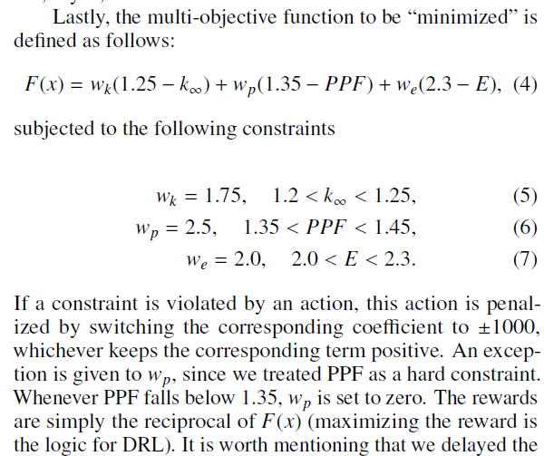

# BWR 6x6 Benchmark Environment

This environment is a benchmark of 6x6 BWR assembly with 1/2 symmetry (21 possible positions), two discrete enrichments are possible per location (1.87, 2.53), the positions are assigned as:
```
1
2 3
4 5 6
7 8 9 10
11 12 13 14 15
16 17 18 19 20 21 
```
`data.tar.gz` contains the dataset which is two csv files for the inputs (enrichments in all 21 positions) and outputs (keff, ppf, enrichment)

The objective function is:



Of the 2M solutions, you should find 59 top solutions all with same objective function value of 0.016.

### Running the random agent:


### Running the examples:


### Visualization:
